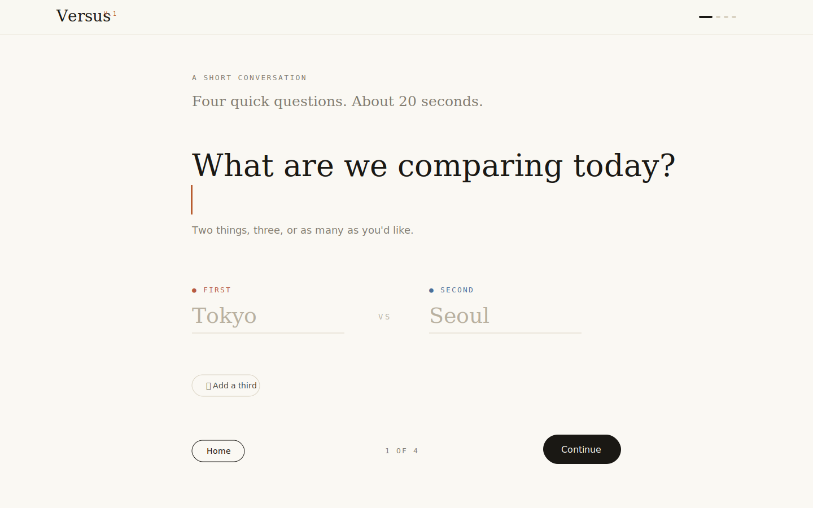
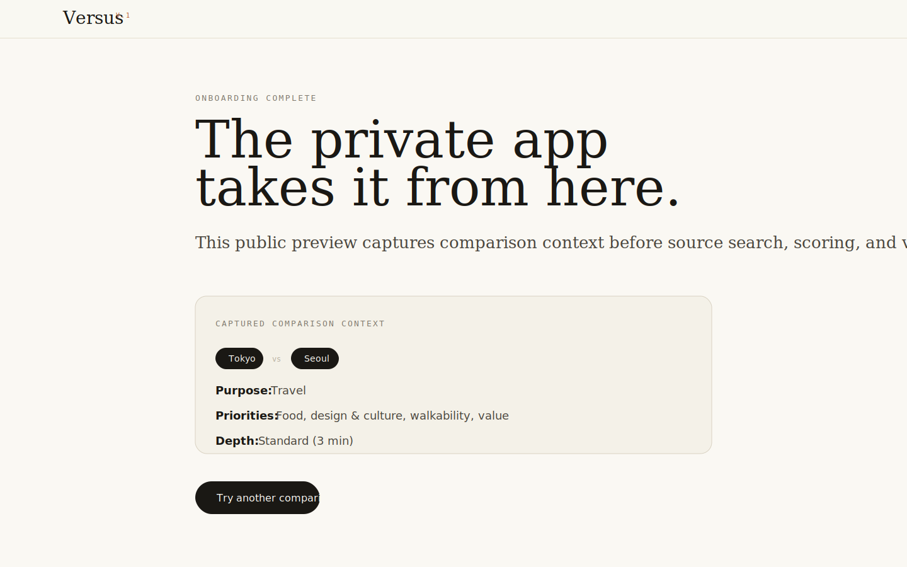

# Versus — Compare Anything, Thoughtfully

A small, calm tool that compares anything — searches the web, weighs what you actually care about, and tells you which one and why.

**Try the full website:** [versus-live.up.railway.app](https://versus-live.up.railway.app/)

**Public preview:** this repository contains only the onboarding page for Versus.

---

## Demo

The full product is live here: [https://versus-live.up.railway.app/](https://versus-live.up.railway.app/)

This repository lets people inspect and run the public onboarding flow locally:

[Onboarding question screen](demo/onboarding-question.svg)



[Onboarding complete screen](demo/onboarding-complete.svg)



## What this repo is

This is the public-facing slice of Versus: the short conversation that asks what you are comparing, what the comparison is for, what matters most, and how deep the analysis should go.

It is meant to show the product shape, interaction model, and editorial tone without exposing the private app internals.

## What is private

The full Versus app remains private. That private repo contains the source search, synthesis, scoring, result generation, provider configuration, and deployment code.

This preview does not call an API, require an API key, or generate a final verdict. After onboarding completes, it shows the captured comparison context.

## Why onboarding matters

Most comparison tools start with fixed categories or generic rankings. Versus starts by asking for context, because "best" changes depending on what you are trying to do.

The onboarding flow captures:

- The items being compared
- The purpose of the comparison
- The priorities that should shape the verdict
- The desired research depth

It also includes lightweight category detection so suggested priorities feel relevant for travel, phones, AI models, cars, laptops, software, wearables, and other common comparison types.

## Run it locally

```bash
npm start
```

Open [http://localhost:3000](http://localhost:3000).

No install step is required for the preview. React and Babel are loaded from pinned CDN URLs, matching the lightweight structure of the private prototype.

Use `npm start` for this public repo. `npm run dev` belongs to the private/full app because that version includes the API proxy and model-provider environment variables.

## Files

- `index.html` mounts the public onboarding preview.
- `onboarding.jsx` contains the conversational onboarding flow.
- `data.jsx` contains sample category profiles and priority suggestions.
- `shared.jsx` contains small shared UI primitives.
- `styles.css` contains the editorial design system.
- `demo/` contains lightweight screenshots/previews for GitHub visitors.

## License

[MIT](LICENSE) — do whatever you want with the code, including commercial use. Attribution appreciated but not required.
